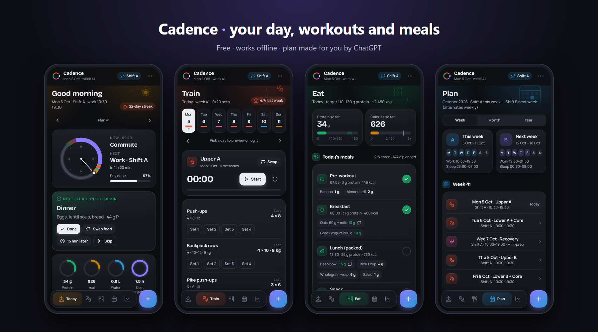
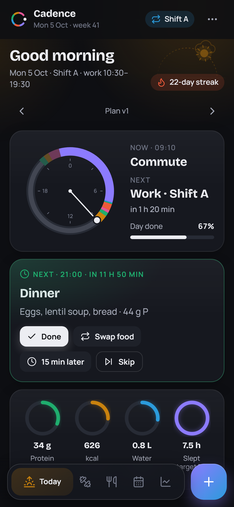
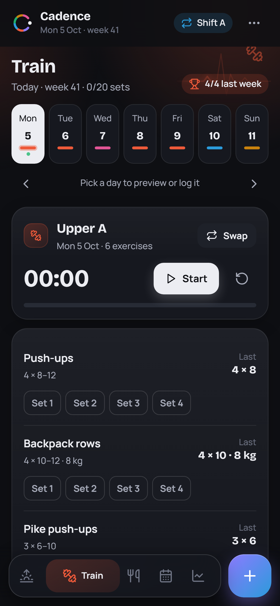
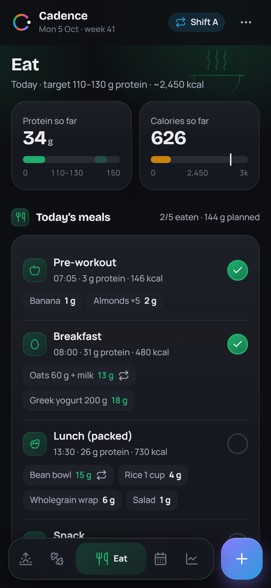
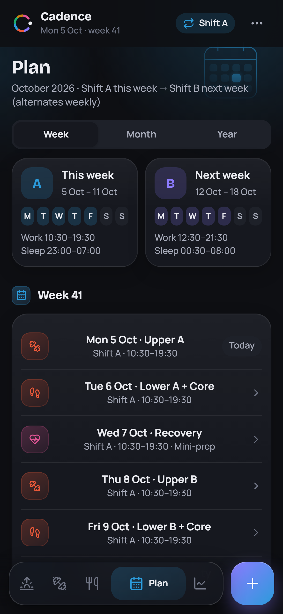
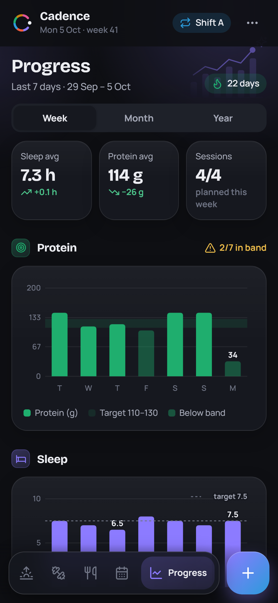
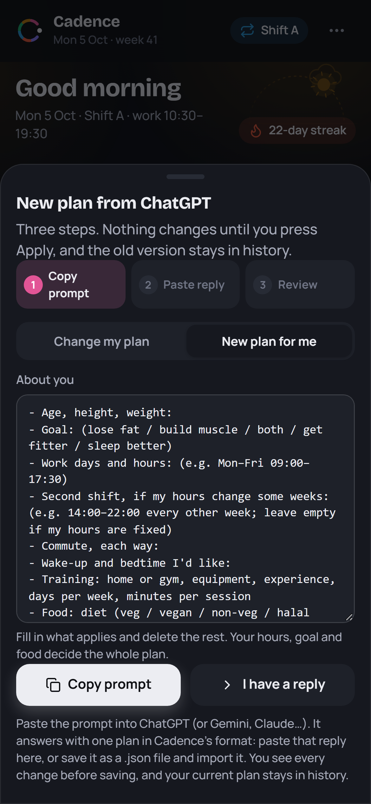

# Cadence

**Your day, workouts and meals in one simple app.**
It's free, works offline, and everything stays on your phone.

👉 **Open the app: https://p-sandeep42.github.io/cadence/**

| Today | Train | Eat |
|:---:|:---:|:---:|
|  |  |  |
| **Plan** | **Progress** | **Make my plan** |
|  |  |  |

---

## Install

- **Android:** open the link in Chrome, then ⋮ → **Install app** (or **Add to Home screen**).
- **iPhone:** open the link in Safari, then Share → **Add to Home Screen**.

Once installed, it opens like a normal app and works without internet.

## Daily use

- **Today**: your day as a timeline. Tick each block as you go and the app moves you on to the next one.
  - Running late? Use **15 min later**, or **Skip**.
  - Rough day? Turn on **Minimum day** to keep only the essentials.
- **Train**: today's workout. Tap a set when it's done. The app remembers your last session and tells you when to add a rep or a little weight.
- **Eat**: your meals for the day, with protein, calories and water. **Swap food** gives you an alternative, and there's a weekly grocery list.
- **Plan**: this week and next week at a glance, with month and year views.
- **Progress**: sleep, protein, sessions and weight trends over a week, month or year.
- **+ button**: quickly log water, weight, extra food, energy or a note.

## Get a plan made for you (about 2 minutes)

The app starts with a sample plan. To get one built for your own hours, goal and food:

1. In the app, tap **Make my plan** on Today (or Settings → **Make a plan for me**).
2. Fill in a few lines about you, then tap **Copy prompt**.
3. Paste it into **ChatGPT** (Gemini or Claude work too).
4. Copy the whole reply. Back in the app, tap **I have a reply** → paste → **Review** → **Save**.

You see every change before anything is saved, and the previous plan stays in history.

**Without the app open?** The prompt is here: **https://p-sandeep42.github.io/cadence/prompt.txt**
Fill in the "About me" part and paste it into ChatGPT. Save the reply as a `.json` file, then in the app use Settings → **Import a plan file**.

### What to tell ChatGPT

The more specific you are, the better the plan. The prompt asks for all of this, so just fill in what applies:

- **Body and goal**: age, height, weight; lose fat, build muscle, both, get fitter, or sleep better.
- **Work**: days and hours (e.g. *Mon–Fri 09:00–17:30*), plus a second shift if your hours change some weeks (e.g. *14:00–22:00 every other week*), and your commute.
- **Sleep**: when you'd like to wake up and go to bed.
- **Training**: home or gym, equipment, experience, days per week, minutes per session, and any injuries.
- **Food**: veg, vegan, non-veg or halal, foods you like or avoid, your cuisine, your budget, and whether you cook or meal-prep.
- **Anything else**: e.g. *"I walk the dog at 7"*, *"no training on Sundays"*, *"I'm a student with lectures till 4"*.

Some examples:

> *"Nurse on 12-hour shifts, 3 days a week, alternating day and night weeks. Want to lose 6 kg. Home workouts only, 20 minutes. South Indian vegetarian food."*

> *"Office job Mon–Fri 9–6, 40 min commute. Gym 4 days a week, intermediate. Want to build muscle. High protein, eat eggs and chicken, no pork."*

### Changing your plan later

Open **Plan → Update from GPT → Change my plan** and describe what you want, e.g. *"move my workout to the evening"*, *"I'm vegetarian now"* or *"add a 30-minute walk after lunch"*. ChatGPT changes only that, and you review the difference before saving.

### Tips

- **Same hours every week?** Settings → Shift pattern → **Always A**. (The app supports two alternating shifts, A and B, for people whose hours change week to week.)
- **The review shows errors?** Copy them back to ChatGPT with *"fix these errors and send the whole JSON again"*.
- **Have your own AI key?** Settings → AI assistant can send the prompt straight to any OpenAI-compatible service, so there's no copy-paste. It's optional, and the key stays on your phone.

## Your data

- **No account and no server.** Everything is stored on your phone, in the browser's storage for this app.
- **Back up** from Settings → Data → **Back up everything**: one file with your plan, every plan version, all logs and settings. Restore it on any phone with **Restore from backup**. There's also an optional weekly backup reminder, and the app keeps weekly snapshots of its own.
- **Export to Excel**, or use **Add to phone calendar** (an `.ics` file with an alarm for each block).
- Clearing the browser's data for this site, or uninstalling, deletes your data, so back up now and then.

## Questions

- **Does it cost anything?** No. ChatGPT's free tier is enough to make a plan.
- **Does it work offline?** Yes, after the first visit.
- **How do updates arrive?** Automatically. Close the app fully and reopen it to get the newest version.
- **Is this medical advice?** No. The plan comes from an AI and the sample is generic. Check with a doctor before starting a new diet or training programme, especially with a health condition.
